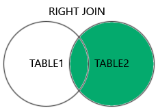
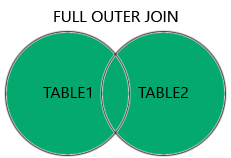

`docker-compose up --build`
```
environment:
- POSTGRES_USER=qasim
- POSTGRES_PASSWORD=my_password
- POSTGRES_DB=mydatabase
ports:
- '5433:5432'
```
    * **5433**


https://chatgpt.com/share/4c03b4b0-3594-4b8e-b2be-3869c1777131


----------
# SQL queries


### q1
```sql

SELECT 
	student_id,
	student_name,
	teacher_id
FROM
	students;
```

### q2
```sql
SELECT
	teacher_id,
	student_name,
	student_name,
	student_name,
	student_id
	
FROM
	students;
```

### q3 Adnan query
```sql
SELECT
	subject,
	teacher_name
FROM
	teachers;
```

### q4
```sql
SELECT
	student_name,
	teacher_name
FROM
	students,
	teachers;
```


### q5 cross join (wrong way)
```sql
SELECT
	students.student_id,
	students.student_name,
	teachers.teacher_id,
	teachers.teacher_name
FROM
	students,
	teachers;
```

### q6 Inner join

```sql
SELECT
	students.student_id,
	students.student_name,
	teachers.teacher_id,
	teachers.teacher_name
FROM
	students,
	teachers
WHERE
	students.teacher_id = teachers.teacher_id;
	
```

### q7 task select two columns each tables (Sara completed)
```sql
SELECT 
	s.student_id,
	s.student_name,
	f.fee_amount,
	f.fee_paid_date,
	t.teacher_name
	
FROM
    students s inner join teachers t on s.teacher_id=t.teacher_id,
	students st inner join fees f on st.student_id=f.student_id;
```

```sql
SELECT 
	s.student_id,
	s.student_name,
	f.fee_amount,
	f.fee_paid_date,
	t.teacher_name
	
FROM
    students s inner join teachers t on s.teacher_id=t.teacher_id,
	students st inner join fees f on st.student_id=f.student_id;
```






